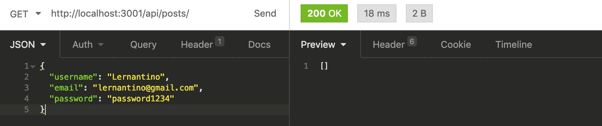

# Module 13: Object Relational Mapping (ORM)

## 13.1 Intro: Run Web Server with Sequelize to Create Database Tables

-   Set up the application to use Sequelize to manage SQL data.
-   Use environment variables to protect sensitive data.
-   Create a user table using Sequelize models.
-   Create all of the server endpoints using RESTful API standards to work with the User model’s data.

| Lesson # | Task                                                                                               |
| -------- | -------------------------------------------------------------------------------------------------- |
| 13.1     | Set up the application to use Sequelize to manage SQL data.                                        |
| 13.2     | Use environment variables to protect sensitive data.                                               |
| 13.3     | Create a user table using Sequelize models.                                                        |
| 13.4     | Create all of the server endpoints using RESTful API standards to work with the User model’s data. |

### 13.1.2 Preview

_Set up your application’s file structure before creating models and their associated routes. Application’s architecture will include a models folder._

| Step | Task                                     | Description                                                                                       |
| ---- | ---------------------------------------- | ------------------------------------------------------------------------------------------------- |
| 1    | Set up the project.                      | create the project’s repository in GitHub and establish the feature branches using issues.        |
| 2    | Scaffold our application’s architecture. | structure the application to use Sequelize and Express.js to keep the code organized.             |
| 3    | Create the user model.                   | use Sequelize’s model syntax to set up what will become the user table in the database.           |
| 4    | Create API routes for the user model.    | create API endpoints using the REST paradigm to perform CRUD operations on the user model’s data. |

### 13.1.3 Set Up the Project

create repo `just-tech-news`

#### GitHub Issues

**Title:**
Users can create, read, update, and delete a profile in the database

**Body:**
**User Stories**

-   As a user, I can create my own profile that stores information about me
-   As a user, I can retrieve my profile data or another user's profile data
-   As a user, I can update my profile data
-   As a user, I can delete my profile

**Title:**
Add security and authentication

**Body:**
**User Stories**

-   As a user, I can log into my account

**Title:**
Create and manipulate posts

**Body:**
**User Stories**

-   As a user, I can create a post
-   As a user, I can retrieve all of my posts
-   As a user, I can retrieve a post by id
-   As a user, I can update the title of a post
-   As a user, I can delete a post

**Title:**
Enable users to vote on posts

**Body:**
**User Stories**

-   As a user, I can vote on a post
-   As a user, I can see who voted on a post

**Title:**
Create and manipulate comments on post data

**Body:**
**User Stories**

-   As a user, I can leave a comment on another user's post
-   As a user, I can see comments other users leave on my posts
-   As a user, I can delete a comment on a post

#### Repo setup

-   clone into repo
-   create `develop` branch
-   create `feature/user-model` branch

### Scaffold the Application Architecture

#### Set Up Node.js

-   ensure in root of cloned repo folder
-   Packages
    -   `npm init` optional `-y` - entry point should be `server.js`. If `npm init -y` used, update `package.json` to `"main": "server.js"` instead of `"main": "index.js"`
    -   update `package.json` with the script: `"start": "node server.js"`
-   Create a `.gitignore` file, adding:
    -   `node_modules`
    -   `DS_Store`
-   Create a `server.js` file
-   Create folders
    -   `models`
    -   `routes`
    -   `config`
    -   `db`
-   install dependencies: `npm install express sequelize mysql2`

#### Hello, Sequelize

By using SQL in Node.js, you're mixing two different languages. - When queries become more involved, this gets tricky.

-   Need to validate data for security.

##### Sequelize benefits

| Problem                                                  | Sequelize Solution                                               |
| -------------------------------------------------------- | ---------------------------------------------------------------- |
| time-consuming to write SQL to define tables and queries | Use object-oriented concepts to model db tables using js classes |
| security concerns                                        | add validators and custom rules to SQL data                      |

#### Create and Connect to the Database

create `schema.sql` and add:

```
DROP DATABASE IF EXISTS just_tech_news_db;
CREATE DATABASE just_tech_news_db;
```

Get into MySql by running `mysql -u root -p` (need Command Prompt in Windows, not GitBash)

`source db/schema.sql`

`show databases;` to confirm it worked.

`quit` MySQL CLI

#### Create the Database Connection

create `config/connection.js` and add:

```
// import the Sequelize constructor from the library
const Sequelize = require('sequelize');

// create connection to our database, pass in your MySQL information for username and password
const sequelize = new Sequelize('just_tech_news_db', 'username', 'password', {
  host: 'localhost',
  dialect: 'mysql',
  port: 3306
});

module.exports = sequelize;
```

-   `new Sequelize()` function accepts
    -   db name
    -   MySQL username
    -   MySQL password
    -   config settings

**important**: MySQL username & password is exposed now.

#### Set Up Environment Variables

Deploying with Express.js involves setting server's port config like so:

```
const PORT = process.env.PORT || 3001;
```

Heroku & other production environments can't reserve port 3001 and provide it dynamically. `process.env.PORT` variable instructs app to use the port provided by production environment.

Therefore:

-   db credentials used for deploying to production won't be the same as the local credentials
-   best practice is to set up local environment variables for development, then use the production environment variables when we deploy to Heroku

Therefore:

-   sensitive data not exposed on GitHub
-   need NPM package `dotenv`

##### Setting Up `dotenv`

`npm install dotenv`

create file `.env` in root of app

add code:

```
DB_NAME='just_tech_news_db'
DB_USER='your-mysql-username'
DB_PW='your-mysql-password'
```

Load environment variables into `connection.js`. Update to look like this code:

```
const Sequelize = require('sequelize');

require('dotenv').config();

// create connection to our db
const sequelize = new Sequelize(process.env.DB_NAME, process.env.DB_USER, process.env.DB_PW, {
  host: 'localhost',
  dialect: 'mysql',
  port: 3306
});

module.exports = sequelize;
```

-   Don't need to save `require('dotenv')` to a variable. It just executes when we use `connection.js`, making all data in the `.env` file available to `process.env.<ENVIRONMENT-VARIABLE-NAME>`
-   **IMPORTANT** add `.env` to `.gitignore`, otherwise you'll push up the info you're trying to hide.

### 13.1.5 Create the User Model

I'm having trouble finding the info I need in the documentation. AskBCS person suggested:
Sequelize documentation on:

[findAll()](https://sequelize.org/v5/class/lib/model.js~Model.html#static-method-findAll),

[create()](https://sequelize.org/v5/class/lib/model.js~Model.html#static-method-create),

[update()](https://sequelize.org/v5/class/lib/model.js~Model.html#static-method-update),

[destroy()](https://sequelize.org/v5/class/lib/model.js~Model.html#static-method-destroy) methods, as well as

[how to apply the "where" clause](https://sequelize.org/v5/manual/querying.html#where).

Like SQL, js's constructors and classes should make application's dataflow consistent.

[Sequelize **model** class](https://sequelize.org/v5/manual/models-definition.html) takes object-oriented js concepts and applies them to how we set up SQL tables.

-   js class defines columns, data types, etc.
-   serves as layer between API and database
-   handles all transactions between the two
-   more flexibility and functionality

#### Setting up Sequelize

-   create `User.js` in `models` dir.
-   add code:

```
const { Model, DataTypes } = require('sequelize');
const sequelize = require('../config/connection');

// create our User model
class User extends Model {}

// define table columns and configuration
User.init(
{
// TABLE COLUMN DEFINITIONS GO HERE
},
{
// TABLE CONFIGURATION OPTIONS GO HERE (https://sequelize.org/v5/manual/models-definition.html#configuration))

    // pass in our imported sequelize connection (the direct connection to our database)
    sequelize,
    // don't automatically create createdAt/updatedAt timestamp fields
    timestamps: false,
    // don't pluralize name of database table
    freezeTableName: true,
    // use underscores instead of camel-casing (i.e. `comment_text` and not `commentText`)
    underscored: true,
    // make it so our model name stays lowercase in the database
    modelName: 'user'

}
);

module.exports = User;
```

-   imported `Model` class and `DataTypes` object from Sequelize
    -   `Model` class used to create our own models using `extends` keyword
    -   Thus, `User` inherits all functionality the `Model` class has

#### Define Columns for the Model

-   column names
-   rules they follow
-   capture username, email, pw

Update `User` model to define these columns:

```

User.init(
{
// define an id column
id: {
// use the special Sequelize DataTypes object provide what type of data it is
type: DataTypes.INTEGER,
// this is the equivalent of SQL's `NOT NULL` option
allowNull: false,
// instruct that this is the Primary Key
primaryKey: true,
// turn on auto increment
autoIncrement: true
},
// define a username column
username: {
type: DataTypes.STRING,
allowNull: false
},
// define an email column
email: {
type: DataTypes.STRING,
allowNull: false,
// there cannot be any duplicate email values in this table
unique: true,
// if allowNull is set to false, we can run our data through validators before creating the table data
validate: {
isEmail: true
}
},
// define a password column
password: {
type: DataTypes.STRING,
allowNull: false,
validate: {
// this means the password must be at least four characters long
len: [4]
}
}
},
{
sequelize,
timestamps: false,
freezeTableName: true,
underscored: true,
modelName: 'user'
}
);

```

You can find all of the column settings in the [Sequelize model definition documents](https://sequelize.org/v5/manual/models-definition.html) (Links to an external site.) and all of the options for DataTypes in the [Sequelize DataTypes documents](https://sequelize.org/v5/manual/data-types.html) (Links to an external site.).

-   best to define `primaryKey myself so Sequelize doesn't have to create one.
-   each column has its own `type` definition where we use the imported Sequelize `DataTypes` to define what type of data it will be.
-   data validators provided, and you can extend them.

#### Start Building it Out

-   create `models/index.js`
    -   collecting and exporting `User`model data
    -   other models added later
-   add code:

```

const User = require('./User');

module.exports = { User };

```

    -   imports `User` model and exports an object with it as a property

### 13.1.6 Create API Routes for the User Model

Why create that `User` model?

-   Remember in `User.js`, there's `class User extends Model {}` which creates the `User` model by extending it off of the Sequelize `Model` class.
-   This allows it to inherit functionality, a main feature of js.
-   Every time we extend a class from Sequelize `Model` class, that new class (here a model) inherits methods for CRUD (creating, reading, updating, & deleting data from a db)
-   The `.init()` method in `User.init` isthepart that provides context to how those inherited methods should work.

#### Give the Users Some REST

-   create `routes/api/user-routes.js`

Five routes that will work with `User` to perform CRUD operations in`user-routes.js`:

```

const router = require('express').Router();
const { User } = require('../../models');

// GET /api/users
router.get('/', (req, res) => {});

// GET /api/users/1
router.get('/:id', (req, res) => {});

// POST /api/users
router.post('/', (req, res) => {});

// PUT /api/users/1
router.put('/:id', (req, res) => {});

// DELETE /api/users/1
router.delete('/:id', (req, res) => {});

module.exports = router;

```

| API Server Requirement | Endpoint Address |
| ---------------------- | ---------------- |
| users                  | `/api/users`     |
| posts                  | `/api/posts`     |
| comments               | `/api/comments`  |

**REST** = **Re**presentational **S**tate **T**ransfer

-   A pattern that developers use when building an API.
-   Name endpoints in a way that describes the data you're interfacing with (e.g. `/api/users`)
-   Use HTTP methods (`GET`, `POST`, `PUT`, `DELETE`) to describe action you're performing to interface with that endpoint
-   Use proper HTTP status codes (`400`, `404`, `500`)
-   https://restfulapi.net/

#### Implement CRUD Actions

in `user-routes.js`:

##### GET all users

```

// GET /api/users
router.get('/', (req, res) => {
// Access our User model and run .findAll() method
User.findAll()
.then(dbUserData => res.json(dbUserData))
.catch(err => {
console.log(err);
res.status(500).json(err);
});
});

```

-   API endpoint so when client makes GET request to `/api/users`, select all users from the user table in db and send it back as JSON.
-   Remember `User` inherits functionality from Sequelize `Model` class. `.findAll()` is one of the `Model` class's methods.
-   equivalent to SQL `SELECT * FROM users;`
-   Because Sequelize is a js promise-basde library, we can use `.then()` with all of the model methods.

###### GET One User based on its `req.params.id` value

```

// GET /api/users/1
router.get('/:id', (req, res) => {
User.findOne({
where: {
id: req.params.id
}
})
.then(dbUserData => {
if (!dbUserData) {
res.status(404).json({ message: 'No user found with this id' });
return;
}
res.json(dbUserData);
})
.catch(err => {
console.log(err);
res.status(500).json(err);
});
});

```

-   Sequelize allows you to
    -   pass arguments into `.findOne()` method
    -   in other words, js objects to configure the query
    -   in SQL it would be: `SELECT * FROM users WHERE id = 1;`

##### POST route to create a user

```

// POST /api/users
router.post('/', (req, res) => {
// expects {username: 'Lernantino', email: 'lernantino@gmail.com', password: 'password1234'}
User.create({
username: req.body.username,
email: req.body.email,
password: req.body.password
})
.then(dbUserData => res.json(dbUserData))
.catch(err => {
console.log(err);
res.status(500).json(err);
});
});

```

-   using Sequelize's `.create()` method to pass in key/value pairs which were defined in `User` model and the values we get from `req.body.`
-   in SQL, it would be:

```

INSERT INTO users
(username, email, password)
VALUES
("Lernantino", "lernantino@gmail.com", "password1234");

```

##### PUT to Update Existing Data

-   use both `req.body` and `req.params`

```

// PUT /api/users/1
router.put('/:id', (req, res) => {
// expects {username: 'Lernantino', email: 'lernantino@gmail.com', password: 'password1234'}

// if req.body has exact key/value pairs to match the model, you can just use `req.body` instead
User.update(req.body, {
where: {
id: req.params.id
}
})
.then(dbUserData => {
if (!dbUserData[0]) {
res.status(404).json({ message: 'No user found with this id' });
return;
}
res.json(dbUserData);
})
.catch(err => {
console.log(err);
res.status(500).json(err);
});
});

```

-   `.update()` method combines parameters for creating data & looking up data.
-   `req.body` provides the new data we want to use in the update
-   `req.params.id` indicates where we want that new data to be used
-   SQL would be:

```

UPDATE users
SET username = "Lernantino", email = "lernantino@gmail.com", password = "newPassword1234"
WHERE id = 1;

```

##### DELETE method

```

// DELETE /api/users/1
router.delete('/:id', (req, res) => {
User.destroy({
where: {
id: req.params.id
}
})
.then(dbUserData => {
if (!dbUserData) {
res.status(404).json({ message: 'No user found with this id' });
return;
}
res.json(dbUserData);
})
.catch(err => {
console.log(err);
res.status(500).json(err);
});
});

```

-   `destroy()` method deletes data

#### Hook Up the Server

-   create `routes/api/index.js` and add:

```

const router = require('express').Router();

const userRoutes = require('./user-routes.js');

router.use('/users', userRoutes);

module.exports = router;

```

-   keeps API endpoints organized
-   allows API to be scalable
-   more API endpoints will be added & we'll give them prefixed name.

create `routes/idex.js` and add:

```

const router = require('express').Router();

const apiRoutes = require('./api');

router.use('/api', apiRoutes);

router.use((req, res) => {
res.status(404).end();
});

module.exports = router;

```

-   like API folder's `index.js` for purpose of collecting endpoints and prefixing them, this one collects the packaged group of API endpoints and prefixes them with teh path `/api`.
-   second `router.use()` for purpose of requests to endpoints which don't exist. This is a RESTful API practice.

When we import routes to `server.js`, they'll be packaged and ready to go with one file.

`server.js` needs to be at root of entire project. Add code:

```

const express = require('express');
const routes = require('./routes');
const sequelize = require('./config/connection');

const app = express();
const PORT = process.env.PORT || 3001;

app.use(express.json());
app.use(express.urlencoded({ extended: true }));

// turn on routes
app.use(routes);

// turn on connection to db and server
sequelize.sync({ force: false }).then(() => {
app.listen(PORT, () => console.log('Now listening'));
});

```

-   because routes set up in organized way, don't need to import multiple files for different endpoints
-   `router` instance in `routes/index.js` collected everything for us and packaged them up for `server.js` to use
-   importing connection to Sequelize from `config/connection.js`.
    -   at bottom of file, using `sequelize.sync()` method to establish connection to db
    -   "sync" part means that Sequelize takes models and connects them to associated database tables.
    -   If table doesn't exist, Sequelize creates it
-   `{force: false}` in the `.sync()` method prevents dropping and recreating tables on startup

#### Test and Refine the User Routes

-   send POST request to `http://localhost:3001/api/users` with Insomnia. Make sure to create json.
-   Test all endpoints
    -   `/api/users/1`
    -   `/api/users/99` to get 404 return
    -   DELETE request

#### Protect the Passwords

update `user-routes.js`:

```

User.findAll({
attributes: { exclude: ['password'] }
})
.then(dbUserData => res.json(dbUserData))
.catch(err => {
console.log(err);
res.status(500).json(err);
});

```

-   using array in case we add others later

update `User.findOne()`:

```

User.findOne({
attributes: { exclude: ['password'] },
where: {
id: req.params.id
}
})
.then(dbUserData => {
if (!dbUserData) {
res.status(404).json({ message: 'No user found with this id' });
return;
}
res.json(dbUserData);
})
.catch(err => {
console.log(err);
res.status(500).json(err);
});

```

## 13.2

### 13.2.1 Introduction

-   \_Sequelize with third-party node packages to encrypt user passwords so they're not stored as plaintext in the database.
-   _Create a login route to verify user identity._

-   Secure user passwords stored in a database with hashing.
-   Add Sequelize hooks (lifecycle events) at key junctures in the application workflow to process important tasks
-   Use async and await keywords to handle asynchronous functionality to increase legibility.
-   Create user authentication that enables identity verification with a hashed password.

### 13.2.2 Preview

| Step # | Task                                     | Description                                                                                  |
| ------ | ---------------------------------------- | -------------------------------------------------------------------------------------------- |
| 1      | Create a new feature branch.             | Isolate the development code for a new feature.                                              |
| 2      | Introduce bcrypt.                        | Bcrypt is used to hash a password and verify matches.                                        |
| 3      | Use hooks to hash the password.          | Intervene at key moments using Sequelize’s OOP properties in the model to hash the password. |
| 4      | Create the login route for verification. | A separate route will be used to log in and check the user’s credentials.                    |

### 13.2.3 Create a New Feature Branch

`feture/password`

### 13.2.4 Introducing bcrypt

**Hashing** = one-way transformation on a password, turning the pw into another string.

`bcrypt` Node package has good track record.

```

npm install bcrypt

```

Because `User.js` is in `models` folder and creates the `User` data, import `bcrypt` into `User.js`:

```

const bcrypt = require('bcrypt);

```

Use it async to save time

### 13.2.5 Use Hooks to Hash the Password

-   **hooks** or **lifecycle events** are functions called before or after calls in Sequelize. This is how we inject this logic to occur just before a user account is created.
-   Modify the models in `models/Users.js`. Adding hooks
-   nested level of `hooks` property needs to be aded to the second object in `User.init()`

```

User.init(
{
id: {
type: DataTypes.INTEGER,
allowNull: false,
primaryKey: true,
autoIncrement: true
},
username: {
type: DataTypes.STRING,
allowNull: false
},
email: {
type: DataTypes.STRING,
allowNull: false,
unique: true,
validate: {
isEmail: true
}
},
password: {
type: DataTypes.STRING,
allowNull: false,
validate: {
len: [4]
}
}
},
{
hooks: {

    },
    sequelize,
    timestamps: false,
    freezeTableName: true,
    underscored: true,
    modelName: 'user'

}
);

```

Then complete `hooks` property:

```

hooks: {
// set up beforeCreate lifecycle "hook" functionality
beforeCreate(userData) {
return bcrypt.hash(userData.password, 10).then(newUserData => {
return newUserData
});
}
}

```

-   `beforeCreate()` hook executes the `bcrypt` hash function on the plaintext password
-   in `bcrypt` hash function, pass in `userData` object that contains plaintext password in `password` property.
-   `saltRound` value of 10

-   resulting hashed password passed to the Promise object as a `newUserData` object with a hashed `password` property.
-   `return` statement exits out

##### Simplifying with `async/await`

-   `async` keyword used as a prefix to function that contains the asynchronous function
-   `await` can be used to prefix the `async` function

```

hooks: {
// set up beforeCreate lifecycle "hook" functionality
async beforeCreate(newUserData) {
newUserData.password = await bcrypt.hash(newUserData.password, 10);
return newUserData;
},
}

```

#### Hash the Password During the Update

_need to hash passwords when users update them as well_

### 13.2.6 Create the Login Route for Authentication

_create login route that verifies users' identities_

-   can't use GET route for single users because it's based on `req.params.id`, and the user id is unknown to users.
-   need to verify user's identity using email & password. Could use username, but email will be unique

add code below other POST route:

```

router.post('/login', (req, res) => {

// Query operation

})

```

Why use a POST method and not a GET method?

-   login route doesn't create or insert anything, true
-   GET carries request parameter appended in the URL string
-   POST method carries request parameter in `req.body` making it more secure to transfer data from client to server
-   if user's email is in the database, this instance of a user must be returned in a Promise so we can proceed with the password verification process

```

router.post('/login', (req, res) => {
// expects {email: 'lernantino@gmail.com', password: 'password1234'}
User.findOne({
where: {
email: req.body.email
}
}).then(dbUserData => {
if (!dbUserData) {
res.status(400).json({ message: 'No user with that email address!' });
return;
}

    res.json({ user: dbUserData });

    // Verify user

});
});

```

-   queries `User` table using `findOne()` method for the email entered by user
-   assigns it to `req.body.email`

-   if user with that email _not_ found, msg sent back as res to client
-   If email found, next step is to verify user's identity by matching the password from the user and the hashed password in the db.

test it in Insomnia by POSTing to http://localhost:3001/api/users/login with the correct email and pw.

#### Compare the Hashed Password

For dev purposes, going to use the sync method to check passwords with bcrypt

In Object Oriented Programming, an **instance method** returns or makes use of information (i.e. properties) specific to that particular object. Remember thath objects generated from classes are _instances_ of the class.

We should create an instance method on the `User` model definition to access the password property of each user instance.

##### Create Instance Method is `User.js`

What needs to be done?

-   modify `User` to include an instance method called `checkPassword`
    -   takes plaintext password retrieved from the client request at `req.body.email` & compares that with the hashed password.
    -   uses `compareSync` function from `bcrypt`

```

// create our User model
class User extends Model {
// set up method to run on instance data (per user) to check password
checkPassword(loginPw) {
return bcrypt.compareSync(loginPw, this.password);
}
}

```

???

-   `this` keyword allows access to user's properties
-   The `.findOne()` Sequelize method looks for a user with the specified email.
-   The result of the query is passed as `dbUserData` to the `.then()` part of the `.findOne()` method.
-   If the query result is successful (i.e., not empty), we can call `.checkPassword()`, which will be on the `dbUserData` object.
-   We'll need to pass the plaintext password, which is stored in `req.body.password`, into `.checkPassword()` as the argument.

-   The `.compareSync()` method, which is inside the `.checkPassword()` method, can then confirm or deny that the supplied password matches the hashed password stored on the object.
-   `.checkPassword()` will then return `true` on success or `false` on failure. We'll store that boolean value to the variable `validPassword`.

add this code at `// Verify user`

```

const validPassword = dbUserData.checkPassword(req.body.password);

```

-   The instance method was called on the user retrieved from db `dbUserData`

    -   Because instance method returns a Boolean, can be used in conditional statement to verify if user has been verified or not

        ```
        if (!validPassword) {
        res.status(400).json({ message: 'Incorrect password!' });
        return;
        }

        res.json({ user: dbUserData, message: 'You are now logged in!' });
        ```

-   if match returns `false`,
    -   error message sent back to client,
        return statement exits out of function.
-   if there is a match,
    -   conditional statement block is ignored
    -   response with data & message "you are now logged in" is sent.

#### Quiz

Bad idea to store plaintext passwords because Hackers will try to access users' other accounts by using these passwords

##### Question 2

What is the name of the hook in Sequelize that allows logic to be executed in the model before a new instance object is updated?

beforeCreate()
_No, this is the hook to execute logic before the create operation, not the update._
beforeUpdate()
beforeBuild()
beforeChange()

##### Question 3

cleartext = plaintext = unencrypted text

### 13.2.7 Reflection

learned how to:

-   Incorporate a password hashing algorithm package to encode stored user passwords.
-   Intervene during the create and update operations using hooks in the model.
-   Use instance methods to compare user passwords in the login process.
-   Create a login route for authentication.

## 13.3 Create and Manipulate Posts

### 13.3.1 Introduction

_Create the `Post` model and routes enabling CRUD operations (e.g. creating a post_)

-   create `Post` data model to enable users to create and manipulate posts or new articles
-   create the RESTful Express APIs to allow CRUD operations to be performed on the MySQL database, which will be similar to how we created the `User` routes is 13.2.
-   link a user to all their posts
    -   create `post` table
    -   learn how Sequelize defines the association between the `User` and `Post` models
    -   how to request data from multiple tables

Takeaways:

-   Make associations to reflect relationships between models.
-   Use include to JOIN associated table data in queries.
-   Create API endpoints to execute CRUD on a Post.

### 13.3.2 Preview

_You’ll always need to define a model before you can create associations between that model and other models you’ve already created._

| Step # | Task                                  | Description                                                                    |
| ------ | ------------------------------------- | ------------------------------------------------------------------------------ |
| 1      | Create a new feature branch.          | A new branch will isolate the development of the feature.                      |
| 2      | Create the Post model.                | Define the Post data model to declare the columns, data types, and validation. |
| 3      | Define model associations.            | Declare the model’s relationships and the foreign key references.              |
| 4      | Create API routes for the Post model. | Use RESTful APIs to allow the resources for the database to be accessible.     |

### 13.3.3 Create a New Feature Branch

1. checkout to `develop` branch
2. `git pull origin develop` to make sure I'm up-to-date
3. create `feature/post` branch

### 13.3.4 Create the Post Model (Step 2)

Benefits of ORMs

-   reduce mistakes
-   reduce amout of code
-   protect db from vulnerabilities

Sequelize gives constructor function to create instanced data with benefit of SQL persistence.

Benefits of Models

-   auto-building of tables
-   data validation and restriction
-   create relationships among data
-   it's all written in js
-   Many-to-many relationships
-   Migrations
-   Hooks
-   Instance methods
-   Static methods

Examples:

-   If you instruct sequelize column to be a string, it won't accept a boolean.
-   By default, it creates columns `createdAt` and `updatedAt`

#### Setting up Post Model

-   create `model/Post.js`
-   add code to `Post.js`

    -   import modules:
        -   connection to MySQL stored in `connection.js`
        -   `Model` & `Datatypes` from `sequelize` package
        ```
        const = { Model, DataTypes } = require('sequelize');
        const sequelize = require('../config/connection');
        ```
    -   define `Post` model
        ```
        // create our Post model
        class Post extends Model {}
        ```
    -   define columns in the `Post`
    -   configure naming conventions
    -   pass current connection instance to initialize `Post` model

        ```
        // create fields/columns for Post model
        Post.init(
          {
            id: {
              type: DataTypes.INTEGER,
              allowNull: false,
              primaryKey: true,
              autoIncrement: true
            },
            title: {
              type: DataTypes.STRING,
              allowNull: false
            },
            post_url: {
              type: DataTypes.STRING,
              allowNull: false,
              validate: {
                isURL: true
              }
            },
            user_id: {
              type: DataTypes.INTEGER,
              references: {
                model: 'user',
                key: 'id'
              }
            }
          },
          {
            sequelize,
            freezeTableName: true,
            underscored: true,
            modelName: 'post'
          }
        );

        module.exports = Post;
        ```

-   First parameter for `Post.init` defines `Post` schema.
    -   `id` column as primary key & set to auto-increment
    -   define `title` column as a String value.
-   include `post_url` field
    -   defined as a string
    -   validate with `isURL` property = true
-   `user_id` column so we know who posted the article
    -   `references` property establishes relationship between this post and the user by creating reference to `User` model (`id` column defined by primary key in the `key` property. The `user_id` defined as the foregin key)
-   second parameter of `init` method
    -   configure metadata
        -   naming conventions
-   export expression to make `Post` model accessible to other parts of the app.

require it in `models.index.js` and export it from there:

```
const User = require("./User");
const Post = require("./Post");

module.exports = { User, Post };
```

### 13.3.5 Define Model Associations

How will relationship between tables work?

-   A `User` can make many `Post`s.
-   A `Post` will only belong to one `User`.

```
User.hasMany(Post, {
	foreinKey: "user_id",
});

Post.belongsTo(User, {
	foreignKey: "user_id",
});
```

-   defines the relationship of the `Post` model to the `User.`
-   the foreign key is designated at `user_id` in the `Post` model

-   When creating associations between models on the db layer in the schema using SQL, you have to drop the table and recreate it again to implement associations.
-   We need to do the same thing with Sequelize by using `server.js` by changing `({ force: false })` to `true. This forces the tables to re-create if there are any association changes.

    ```
    // turn on connection to d and server
    sequelize.sync({ force: false }).then(() => {
        app.listen(PORT, () => console.log(`Now listening on ${PORT}`));
    });
    ```

-   after refresh, change it back

### 13.3.6 Create API routes for the Post Model

Some developers would argue it would be better to build each section of the app at a time. E.g., create all models at once, routes at once, etc.

#### Get All the Posts

-   create `api/routes/post-routes.js`
-   add code:
    ```
    const router = requrie('express').Router();
    const { Post, User } = require('../../models');
    ```
    -   including `User` here for the `JOIN` that's needed to match the posts to users.

##### Create the Query

```
// get all users
router.get("/", (req, res) => {
    console.log("================");
    Post.findAll({
        // Query configuration
    });
});
```

Which columns will be needed?

-   `id`
-   `post_url`
-   `title`
-   `create_at`

```
Post.findAll({
  attributes: ['id', 'post_url', 'title', 'created_at'],
})
```

-   we set `underscored: true,` in `Post` model. By default it would be camelcase.

-   `include` the `JOIN` to the `User` table:

    ```
    	include: [
    	{
    		model: User,
    		attributes: ["username"],
    	},
    ];
    ```

    -   `include` is an array of objects, refrencing the `model`'s `attributes`

-   create a Promise that captures the response from the database call

    ```
    // get all users
    router.get("/", (req, res) => {
        console.log("================");
        Post.findAll({
            // Query configuration
            attributes: ["id", "post_url", "title", "created_at"],
            include: [
                {
                    model: User,
                    attributes: ["username"],
                },
            ]
        });
        .then(dbPostData => res.json(dbPostData))
        .catch(err => {
            console.log(err);
            res.status(500).json(err);
        });
    });
    ```

-   add code `module.exports = router;`
    -   in order to test this route, expose changes to router with Express.js
    -   needs to be at bottom so that `router` assigned once Express API endpoints have been defined

Routes in `post-routes.js` must be exposed properly with correct URL path. --> assign `postRoutes` to the Express.js router

-   add code to `routes/api/index.js`

        ```
        // packaged group of API endpoints and prefixing them
        const router = require("express").Router();

        const userRoutes = require("./user-routes.js");
        const postRoutes = require("./post-routes.js");

        //
        router.use("/users", userRoutes);
        router.use("/posts", postRoutes);

        module.exports = router;
        ```

    After saving, restarting the server, and running query in Insomnia, the JSON object is empty because there are no posts in the database.
    

##### Seed the `post` table with data using mysql CLI

-   `mysql -u root -p` and enter password
-   `use just_tech_news_db;` and message should be `Database changed`
-   insert entry into the `post` table
    ```
    INSERT INTO post (title, post_url, user_id, created_at, updated_at)
    VALUES ("Taskmaster goes public!", "https://taskmaster/press", 1, CURRENT_TIMESTAMP, CURRENT_TIMESTAMP);
    ```

#### GET a Single Post

```
// GET a single post
router.get("/:id", (req, res) => {
	Post.findOne({
		where: {
			id: req.params.id,
		},
		attributes: ["id", "post_url", "title", "created_at"],
		include: [
			{
				model: User,
				attributes: ["Username"],
			},
		],
	}).then((dbPostData) => {
		if (!dbPostData) {
			res.status(404).json({ message: "No post found with this id" });
			return;
		}
        res.json(dbPostData);
	})
    .catch(err => {
        console.log(err);
        res.status(500).json(err);
    });
});
```

-   `req.pamas.id` to retrieve property from route
-   `where` property to set vaule of `id` using `req.params.id`
-   requesting same attributes as "get all posts," which requires a reference to the `User` model using `include` property.
-   `404` status code ids user error and will need a different request for a successful response

#### Create a Post

```
// POST a new user: /
router.post("/", (req, res) => {
	// expects {title: 'Taskmaster goes public!', post_url: 'https://taskmaster.com', user_id: 1}
	Post.create({
		title: req.body.title,
		post_url: req.body.post_url,
		user_id: req.body.user_id,
	})
		.then((dbPostData) => res.json(dbPostData))
		.catch((err) => {
			console.log(err);
			res.status(500).json(err);
		});
});
```

-   As we did in `user-routes.js`, `req.body` populates the columns in the `post` table

-   add a post in insomnia:
    ```
    {
    "title": "Runbuddy reaches 1 million subscribers",
    "post_url": "https://runbuddy.com/press",
    "user_id": 1
    }
    ```
    -   don't need to assign `created_at` or `updated_at` fields in `req.body` with Sequelize because they're created automatically. SQL does _not_ do this, so they need to be included on CLI.

#### Update a Post's Title

-   is `module.exports` expression still at bottom of file?
-   This route needs to be below the last `POST` route
    -   we're updating an existing entry, so
        -   retrieve the post instance by `id'
        -   alter the value of the `title` on this instance of a post.
    -   use request parameter to find the post
    -   `req.body.title` replaces the title of the post
    -   response sends back data that has been modified and stored in the db

```
// PUT update a post's title
router.put("/:id", (req, res) => {
	// expects {title: 'Taskmaster goes public!', post_url: 'https://taskmaster.com', user_id: 1}

	Post.update(
		{
			title: req.body.title,
		},
		{
			where: {
				id: req.params.id,
			},
		}
	)
		.then((dbPostData) => {
			if (!dbPostData) {
				res.status(404).json({ message: "No post found with this id" });
				return;
			}
			res.json(dbPostData);
		})
		.catch((err) => {
			console.log(err);
			res.status(500).json(err);
		});
});
```

-   save and restart server
-   send `PUT` request with corresponding `req.params.id` and `req.body.title` in the Insomnia request
    ```
    {
        "title": "Runbuddy reaches 2 million subscribers"
    }
    ```
    -   the return will just be a 1. This is SQL's way to verify the number of rows changed in the last query.
-   retrieve all posts to ensure the change was made

#### Delete a Post

use...

-   Sequelize's `destroy` method
-   unique id in the query parameter

...to find and delete this instance of a post

```
router.delete('/:id', (req, res) => {
  Post.destroy({
    where: {
      id: req.params.id
    }
  })
    .then(dbPostData => {
      if (!dbPostData) {
        res.status(404).json({ message: 'No post found with this id' });
        return;
      }
      res.json(dbPostData);
    })
    .catch(err => {
      console.log(err);
      res.status(500).json(err);
    });
});
```

-   test in Insomnia
-   add back in using `POST` route

-   new post created at `id = 3` to avoid any possible references to other tables

##### put newest posts on the top

```
Post.findAll({
  attributes: ['id', 'post_url', 'title', 'created_at'],
  order: [['created_at', 'DESC']],
  include: [
    {
      model: User,
      attributes: ['username']
    }
  ]
})
```

-   bug in sequelize that requires double brackets
    -   `order` property assigned a nested array that orders by `created_at` column in descending order

##### Quiz

What is an advantage of creating the data models on the application layer in Sequelize vs. on the database layer?

We can make changes to the data model by simply restarting the application.
Data models are easier to write when represented as an object.
Allows for business logic to easily occur during data processing with hooks and instance methods.
**All of these reasons. - correct**

We need to drop the tables if we introduce changes to the model associations in Sequelize.

What type of method do we use to perform the password check on the user's password during the login verification process?
correct answer: An instance method.

A static method - no response given

A static method _No, a static method is a class method that is not accessible by an instance of User._
A dynamic method _No such thing_
An instance method - correct
A class method _No, a class method in JavaScript is known as a static method and is called on the object constructor and not on the instance of the object._

## 13.4

### 13.4.1 Introduciton

so far, covered "one-to-many" data relationships.

In this lesson, create "many-to-many" relationship where

-   many users can vote on many posts.
-   use a new table to make this connection between users and posts

The lesson objectives include the following:

-   Create a new Vote model to store data about who is voting on which posts.
-   Implement a many-to-many model association using Sequelize.
-   Create a route allowing a user to vote on a post.
-   Update existing routes to query for related data to see who has voted on what post.
-   Clean up some of the code with a custom static Sequelize model method.

### 13.4.2 Preview

_implement a `Vote` model to serve as a connecting table to track the posts users are voting on._

_Before we can create or update any routes to include vote data, we need to_

1. create the Vote model to hold data connecting the User and Post models. Once we’ve created this model, we should...
2. Create a route to update a post by adding a vote to it.
3. Then we can update the GET routes to return the vote data.
4. Finally, we’ll use a Sequelize feature to clean up the code.

| Step # | Task                                   | Description                                                                                                                   |
| ------ | -------------------------------------- | ----------------------------------------------------------------------------------------------------------------------------- |
| 1      | Create the Vote model.                 | We’ll create the Vote model that will hold data connecting the User and Post models and create the relationship between them. |
| 2      | Create PUT route for voting on a post. | We’ll create a route that updates a post by adding a vote to it.                                                              |
| 3      | Update GET routes to include votes.    | We’ll edit some of the queries to include data for related votes.                                                             |
| 4      | Refactor messy code.                   | Some of the routes may look a little busy after adding this new code, so let’s use a Sequelize feature to clean it up.        |

### 13.4.3 Create the Vote Model

_We’ll create the Vote model that will hold data connecting the User and Post models and create the relationship between them._

In one-to-many relationships, the owned data entity holds a reference to its owner. The owner holds no reference to the data it owns to prevent unnecessary duplication

In many-to-many relationships, each side must hold a reference to its counterpart. A third table known as a **through table** will connect the data between the two other tables with their primary keys.

create `models/Vote.js` and add:

```
const { Model, DataTypes } = require("sequelize");
const sequelize = require("../config/connection");

class Vote extends Model {}

Vote.init(
	{
		id: {
			type: DataTypes.INTEGER,
			primaryKey: true,
			autoIncrement: true,
		},
		// What needs to go here?
	},
	{
		sequelize,
		timestamps: false,
		freezeTableName: true,
		underscored: true,
		modelName: vote,
	}
);

model.exports = Vote;
```

Need to have rows to list primary key of the user and the primary key of the post they voted on:

```
Vote.init(
	{
		id: {
			type: DataTypes.INTEGER,
			primaryKey: true,
			autoIncrement: true,
		},
        // inclued user_id and post_id to track ownership of posts
		user_id: {
			type: DataTypes.INTEGER,
			allowNull: false,
			references: {
				model: "user",
				key: "id",
			},
		},
		post_id: {
			type: DataTypes.INTEGER,
			allowNull: false,
			references: {
				model: "post",
				key: "id",
			},
		},
	},
	{
		sequelize,
		timestamps: false,
		freezeTableName: true,
		underscored: true,
		modelName: vote,
	}
);
```

Need to instruct the `User` and `Post` models how they can query on one another through this `Vote` model

#### Create a Many-to-Many Association

add to `models/index.js`: `const Vote = require('./Vote');`

associate `User` and `Post` to one another so when we

-   query `Post`, we can see a total of how many votes a user creates
-   query a `User`, we can see all the posts they've voted on.
-   use `belongsToMany()`, _not_ `.hasMany()`
    -   using two `belongsToMany()` allows both `User` and `Post` to query each other's info in the context of a vote.
        -   see which users voted on a single post
        -   see which posts a single user voted on
-   `Vote` table needs a **foreign key constraint**: a row of data to be a unique pairing.
-   Many-to-Many relationships power most data. E.g., A necklace that belongs to "Necklaces" _and_ "silver" _and_ etc.

add to `models/index.js`

```
User.belongsToMany(Post, {
	through: Vote,
	as: "voted_posts",
	foreignKey: "user_id",
});

Post.belongsToMany(User, {
	through: Vote,
	as: "voted_posts",
	foreignKey: "post_id",
});
```

##### Connect `User` and `Vote` Directly
_creating one-to-many associations directly between these models allows aggregated SQL functions between models_

```
Vote.belongsTo(User, {
	foreignKey: "user_id",
});

Vote.belongsTo(Post, {
	foreignKey: "post_id",
});

User.hasMany(Vote, {
	foreignKey: "user_id",
});

Post.hasMany(Vote, {
	foreignKey: "post_id",
});
```

## Save Point
